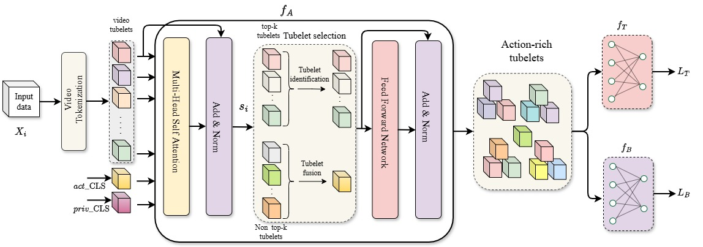
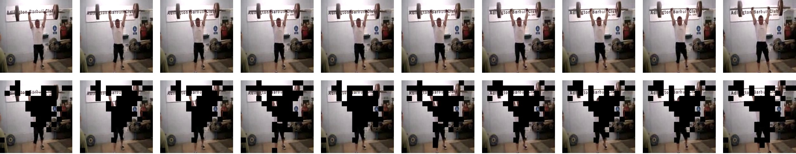
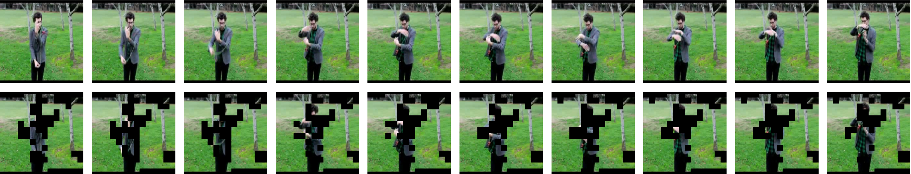
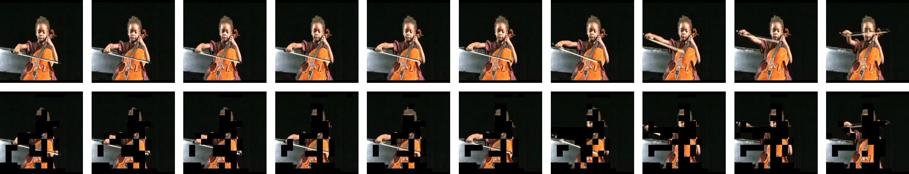
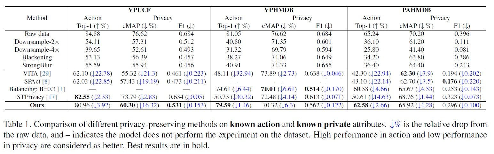
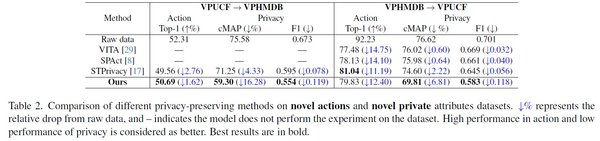

# From Pixels to Privacy: Temporally Consistent Video Anonymization via Token Pruning for Privacy Preserving Action Recognition

<p align="center">
  <a href="https://github.com/Rabusi/From-Pixels-to-Privacy-Temporally-Consistent-Video-Anonymization-via-Token-Pruning-for-Privacy-Pres/stargazers">
    
  </a>
  <a href="https://github.com/Rabusi/From-Pixels-to-Privacy-Temporally-Consistent-Video-Anonymization-via-Token-Pruning-for-Privacy-Pres/network/members">
    
  </a>
  <a href="https://arxiv.org/abs/2504.14301">
    
  </a>
</p>

<p align="center">
  ⭐ If you find this work useful for your research, please consider starring this repository.
</p>

---

## 📄 Abstract

Recent advances in large-scale video models have significantly improved video understanding across domains such as surveillance, healthcare, and entertainment. However, these models also amplify privacy risks by encoding sensitive attributes, including facial identity, race, and gender. While image anonymization has been extensively studied, video anonymization remains relatively underexplored, even though modern video models can leverage spatiotemporal motion patterns as biometric identifiers.

To address this challenge, we propose a novel attention-driven spatiotemporal video anonymization framework based on the systematic disentanglement of utility and privacy features. Our key insight is that attention mechanisms in Vision Transformers (ViTs) can be explicitly structured to separate action-relevant information from privacy-sensitive content.

Building on this insight, we introduce two task-specific classification tokens: an **action CLS token** and a **privacy CLS token**, which learn complementary representations within a shared Transformer backbone. We contrast their attention distributions to compute a utility–privacy score for each spatiotemporal tubelet and retain the top-*k* tubelets with the highest scores. This selectively prunes tubelets dominated by privacy cues while preserving those most critical for action recognition.

Extensive experiments demonstrate that our approach maintains action recognition performance comparable to models trained on raw videos, while substantially reducing privacy leakage. These results indicate that attention-driven spatiotemporal pruning offers an effective and principled solution for privacy-preserving video analytics.

---

## 🏗️ Project Structure

```text
From-Pixels-to-Privacy/
├── action_training/
├── privacy_training/
├── sparsification/
├── aux_code/
├── annotations/
├── images/
├── conda_requirements.txt
├── pip_requirements.txt
├── stprivacy.yml
├── README.md
└── LICENSE
```

---

## 🧩 Proposed Framework

<p align="center">
  
</p>

---

## 🖼️ Anonymized Images

<p align="center">
  
  
  
</p>

---

## 📊 Results

<p align="center">
  
</p>

<p align="center">
  
</p>

---

## 📬 Contact

For any inquiries or feedback, feel free to reach out:

- **Nazia Aslam**
- **Email:** [naas@create.aau.dk](mailto:naas@create.aau.dk)

---

## ⭐ Citation

If you use this work in your research, please cite:

```bibtex
@article{aslam2025pixelsprivacy,
  title={From Pixels to Privacy: Temporally Consistent Video Anonymization via Token Pruning for Privacy Preserving Action Recognition},
  author={Aslam, Nazia and Ray, Abhisek and Haurum, Joakim Bruslund and Esterle, Lukas and Nasrollahi, Kamal},
  journal={arXiv preprint arXiv:2504.14301},
  year={2025}
}
```
